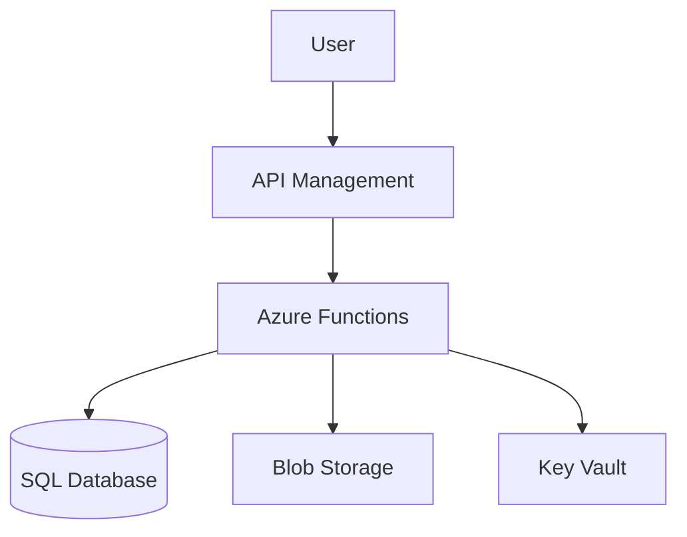

# Azure Builder - Implementation Plan
**Date:** March 1, 2026  
**Goal:** Complete the AI Solution Architect SaaS with all critical features

---

## ✅ Already Implemented (Feb 26-27)

- Multi-option architecture generation (AI engine)
- Real-time pricing (Azure Retail Prices API)
- Approval workflow (review → approve → deploy)
- Audit logging (ExecutionLog)
- Multi-tenant with RBAC

---

## 🔴 Critical Missing Features

### 1. Budget Constraint Input
**Problem:** Users can't specify "I have $200/month budget"  
**Solution:**
- Add `budget_limit` field to Project model
- AI engine filters/ranks options by budget
- Flag options that exceed budget in UI

### 2. Quota & Limit Checking
**Problem:** App doesn't verify if Azure subscription can support the proposal  
**Solution:**
- Call Azure Resource Manager API to get subscription quotas
- Check limits for vCPUs, storage accounts, public IPs, etc.
- Warn user if proposal exceeds available quota
- Suggest quota increase request

**API Endpoints:**
```
GET /subscriptions/{id}/providers/Microsoft.Compute/locations/{location}/usages
GET /subscriptions/{id}/providers/Microsoft.Network/locations/{location}/usages
GET /subscriptions/{id}/providers/Microsoft.Storage/locations/{location}/usages
```

### 3. Visual Architecture Diagrams
**Problem:** ASCII diagrams are not customer-friendly  
**Solution:**
- Use **Mermaid.js** or **Diagrams.net** to generate visual diagrams
- AI outputs Mermaid syntax, frontend renders it
- Export as PNG/SVG

**Example Mermaid:**


### 4. Azure MCP Integration ✅ **RECOMMENDED**
**Problem:** App might use outdated API versions or commands  
**Solution:**
- Integrate **Microsoft's Azure MCP server** (Model Context Protocol)
- MCP provides:
  - Latest Azure CLI commands
  - Current API versions
  - Subscription awareness (existing resources)
  - Best practices and warnings

**Why MCP is perfect for this:**
- Always up-to-date (maintained by Microsoft)
- Context-aware (knows what's already deployed)
- Can query existing infrastructure
- Security best practices built-in

**Implementation:**
```python
# Use MCP to check existing resources before proposing
existing_resources = await mcp_client.query_resources(subscription_id)

# Use MCP to validate Bicep before deployment
validation = await mcp_client.validate_template(bicep_content)

# Use MCP to get latest API versions
api_version = await mcp_client.get_api_version("Microsoft.Web/sites")
```

### 5. Deployed Resource Tracking
**Problem:** No record of what's actually running in customer's Azure  
**Solution:**
- After successful deployment, store resource IDs in database
- Periodically sync with Azure to detect drift
- Show "Your Infrastructure" dashboard with deployed resources
- Track costs for deployed resources (Azure Cost Management API)

**New table:**
```sql
CREATE TABLE deployed_resources (
    id UUID PRIMARY KEY,
    deployment_id UUID REFERENCES deployment_requests(id),
    resource_id VARCHAR(500),  -- Azure resource ID
    resource_type VARCHAR(100),
    name VARCHAR(200),
    status VARCHAR(50),
    monthly_cost DECIMAL(10,2),
    created_at TIMESTAMP,
    last_synced_at TIMESTAMP
);
```

### 6. Security Validation
**Problem:** No security checks before deployment  
**Solution:**
- Validate proposals against Azure Security Benchmark
- Check for:
  - ✓ Network Security Groups (NSG) configured
  - ✓ Key Vault used for secrets
  - ✓ Managed Identity instead of passwords
  - ✓ HTTPS enforced
  - ✓ Public access disabled where possible
  - ✓ Diagnostic logging enabled
  - ✓ Encryption at rest enabled

**Implementation:**
```python
class SecurityValidator:
    async def validate_proposal(self, resources: List[ResourceDefinition]) -> SecurityReport:
        issues = []
        
        # Check for exposed databases
        for resource in resources:
            if resource.type == "Microsoft.Sql/servers":
                if not resource.properties.get("publicNetworkAccess") == "Disabled":
                    issues.append(SecurityIssue(
                        severity="HIGH",
                        resource=resource.name,
                        issue="SQL Server allows public network access",
                        recommendation="Enable private endpoints or disable public access"
                    ))
        
        # Check for Key Vault usage
        has_secrets = any(r.needs_credentials for r in resources)
        has_keyvault = any(r.type == "Microsoft.KeyVault/vaults" for r in resources)
        if has_secrets and not has_keyvault:
            issues.append(SecurityIssue(
                severity="HIGH",
                issue="Secrets detected but no Key Vault in architecture",
                recommendation="Add Azure Key Vault for secure credential storage"
            ))
        
        return SecurityReport(issues=issues, score=calculate_score(issues))
```

### 7. Latest API Version Management
**Problem:** Hardcoded API versions become outdated  
**Solutions:**

**Option A: Azure MCP (Recommended)**
- MCP maintains latest versions
- Query MCP for current API version before generating templates

**Option B: Azure Resource Provider API**
```python
# Get latest API version dynamically
async def get_latest_api_version(resource_type: str) -> str:
    """Query Azure for latest stable API version."""
    # Example: Microsoft.Web/sites
    provider, resource = resource_type.split('/', 1)
    
    response = await azure_client.get(
        f"/subscriptions/{sub_id}/providers/{provider}?api-version=2021-04-01"
    )
    
    for rt in response['resourceTypes']:
        if rt['resourceType'] == resource:
            # Return latest non-preview version
            return [v for v in rt['apiVersions'] if 'preview' not in v][0]
```

**Option C: Version Cache with Auto-Update**
- Cache API versions in Redis with 7-day TTL
- Background job refreshes cache weekly
- Fallback to known-good versions if API fails

---

## 📋 Detailed Requirements (From User)

### Example Use Case: Teams Chatbot

**User Request:** "I need a Teams chatbot for customer support"

**App Should:**

1. **Understand constraints:**
   - "What's your budget?" → "$300/month"
   - Check subscription quotas

2. **Generate 3 options:**

   **Option 1: Serverless ($45/month)**
   - Azure Functions (Consumption)
   - Cosmos DB (Serverless)
   - Bot Service (F0 Free)
   - Application Insights
   - 👍 Lowest cost, auto-scales to zero
   - 👎 Cold start latency, limited to 10GB storage

   **Option 2: Container-Based ($180/month)**
   - Azure Container Apps (1 vCPU, 2GB)
   - Azure SQL Database (Basic)
   - Bot Service (S1)
   - Application Insights
   - 👍 No cold starts, persistent connections
   - 👎 Higher cost, need to manage containers

   **Option 3: VM-Based ($420/month)**
   - VM (B2s Standard)
   - Azure SQL (S1)
   - Bot Service (S1)
   - Load Balancer
   - Application Insights
   - 👍 Full control, can install anything
   - 👎 Highest cost, requires patching/maintenance

3. **Show architecture diagram** (Mermaid rendered)

4. **Validate security:**
   - ✓ Bot Service uses Managed Identity
   - ✓ Database has firewall rules
   - ✓ Application Insights enabled
   - ⚠️ WARNING: Option 3 VM needs NSG configuration

5. **Check quotas:**
   - ✓ 8 vCPUs available (Option 3 needs 2)
   - ✓ 3 storage accounts available
   - ✓ Region: East US has capacity

6. **Require approval:**
   - Show estimated monthly cost
   - Show resource list
   - "Click to approve and deploy"

7. **Deploy and track:**
   - Create resources via Bicep
   - Store deployed resource IDs
   - Enable cost tracking

---

## 🔐 Security Features (Must Have)

### Pre-Deployment Security Scan
- [ ] Check for public endpoints (flag or auto-add NSG)
- [ ] Ensure secrets use Key Vault
- [ ] Verify HTTPS enforcement
- [ ] Check managed identity vs. passwords
- [ ] Validate firewall rules
- [ ] Ensure encryption at rest

### Compliance Checks
- [ ] HIPAA-compliant architecture option (if needed)
- [ ] SOC 2 recommendations
- [ ] GDPR data residency (region selection)

### Post-Deployment
- [ ] Microsoft Defender for Cloud integration
- [ ] Security score monitoring
- [ ] Alert on insecure changes

---

## 🏗️ Implementation Order

### Phase 1: Core Completions (This Week)
1. ✅ Budget constraint input (Project.budget_limit)
2. ✅ Quota checking service
3. ✅ Security validation service
4. ✅ Mermaid diagram generation in AI engine

### Phase 2: Azure MCP Integration (Next Week)
1. ✅ Install Azure MCP server
2. ✅ Integrate MCP client in backend
3. ✅ Use MCP for existing resource discovery
4. ✅ Use MCP for latest API versions
5. ✅ Use MCP for validation

### Phase 3: Resource Tracking (Week After)
1. ✅ DeployedResources table
2. ✅ Post-deployment sync
3. ✅ Cost tracking integration
4. ✅ Drift detection

### Phase 4: UI Completion
1. ✅ Render Mermaid diagrams
2. ✅ Show security warnings
3. ✅ Budget input in project creation
4. ✅ Quota warnings in UI
5. ✅ Deployed resources dashboard

---

## 🎯 Success Criteria

A customer should be able to:
1. Say "I need a Teams chatbot, budget $300/month"
2. See 3 options with visual diagrams and costs
3. See security warnings if any
4. Know if their quota supports it
5. Approve with one click
6. See deployment progress
7. Track deployed resources and costs
8. Get alerts if something changes

---

## 📊 Pricing Accuracy

**Current:** Azure Retail Prices API (✓ always up-to-date)  
**Enhancement:** 
- Cache prices for 1 hour (already doing this with Redis)
- Add disclaimer: "Estimates based on East US pricing, actual costs may vary"
- Link to Azure Pricing Calculator for verification

---

## 🔄 Staying Current with Azure

**Recommendation: Use Azure MCP**

Why MCP is ideal:
- ✅ Maintained by Microsoft → always current
- ✅ Knows about new services as they launch
- ✅ Provides context about existing infrastructure
- ✅ Built-in validation and best practices
- ✅ Works with GPT-4 for intelligent suggestions

**Alternative (if MCP not available):**
- Weekly background job to refresh API versions
- Subscribe to Azure updates RSS feed
- Automated testing against Azure sandbox

---

## 🚦 Next Steps

**Should I:**
1. **Build the missing features now?** (Budget input, quota check, security validation)
2. **Integrate Azure MCP?** (If available - I'll check)
3. **Generate visual diagrams with Mermaid?**
4. **Add deployed resource tracking?**

Let me know and I'll start implementing! 🚀
